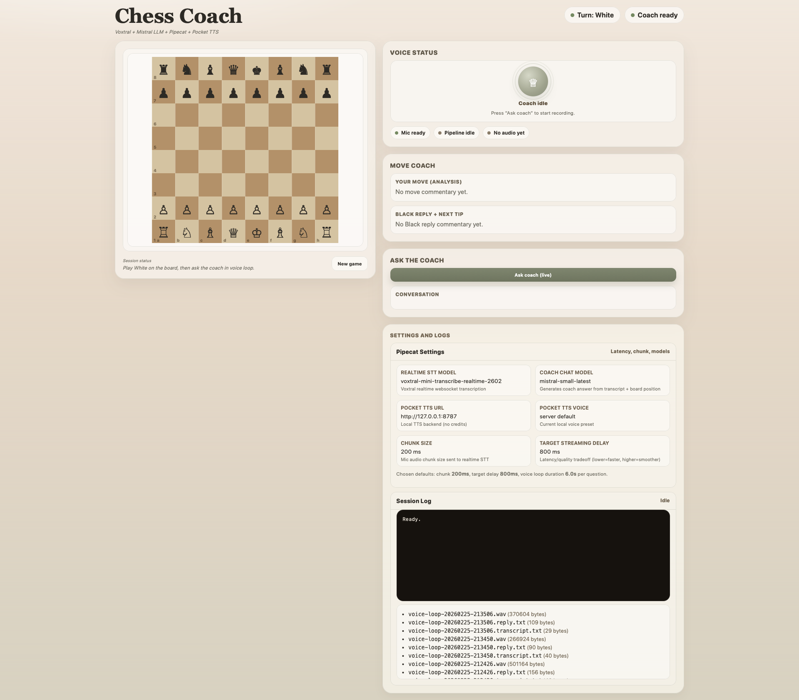

# Chess Coach

A local voice-powered chess coach: you play White, the coach comments on your move, plays Black's response, then gives you a simple plan for the next move.

## Why this project

I wanted a fast prototype for chess coaching with:
- a clean, enjoyable UI
- short pedagogical feedback
- voice interaction (mic + transcription + TTS)
- a minimal Python backend

## Demo Highlights

- Interactive chessboard (White side)
- Coach feedback on your last move
- Black reply selected by an LLM
- Clear next-move advice
- Free-form questions to the coach (text or microphone)
- Audio playback of coach responses (Gradium TTS)

## Screenshots

Add your images to `docs/screenshots/`, then replace the placeholders below.

Recommended structure:

```text
docs/
  screenshots/
    hero-ui.png
    mic-recording.png
    coach-answer.png
```

You can use this block as-is once your images are added:

```md
## Screenshots

### Main UI


### Microphone recording


### Coach answer

```

Optional bonus (if you create a GIF):

```md
### Quick demo (GIF)

```

## Tech Stack

- **Backend**: FastAPI (Python)
- **Frontend**: Single-page HTML / CSS / vanilla JS
- **Chess logic**: `chess.js`
- **LLM**: Mistral (chat + transcription)
- **TTS**: Gradium

## Architecture (simple)

- `main.py`
  - API endpoints (`/coach_move`, `/ask`, `/transcribe`, `/tts`)
  - Embedded web page (HTML/CSS/JS)
- `start.command`
  - One-click macOS launcher (opens the browser automatically)

## Features (detailed)

- Move-by-move coaching:
  - White move analysis
  - Black response
  - Practical next-step advice
- Coach Q&A:
  - text questions
  - voice questions via microphone
- Audio:
  - TTS on/off toggle
  - voice and speed settings
- UX:
  - clear mic states (ready / recording / transcribing)
  - session log
  - responsive desktop/mobile layout

## Local Setup

### Prerequisites

- Python 3.10+ (3.9 may also work depending on your environment)
- A Mistral API key
- A Gradium API key

### Environment variables

Copy `.env.example` to `.env` and fill in:

```bash
MISTRAL_API_KEY="<your_mistral_key>"
GRADIUM_API_KEY="<your_gradium_key>"
# Optional: eu (default) or us
GRADIUM_REGION="eu"
```

### Installation

```bash
cd /path/to/chess-coach-poc
python3 -m venv .venv
source .venv/bin/activate
pip install -r requirements.txt
```

### Run locally

Terminal option:

```bash
.venv/bin/python -m uvicorn main:app --host 127.0.0.1 --port 8001
```

Then open [http://127.0.0.1:8001](http://127.0.0.1:8001)

macOS one-click option:

1. Double-click `start.command`
2. The server starts
3. Your browser opens automatically at `http://127.0.0.1:8001`

## API Endpoints

- `GET /`
- `GET /health`
- `POST /coach_move`
- `POST /ask`
- `POST /transcribe`
- `POST /tts`

## Security / Notes

- API keys stay server-side (`os.getenv`)
- `.env` is ignored by Git (`.gitignore`)
- Fallback to a random legal move if an LLM Black move is invalid
- The microphone stream is released after recording stops (important for the macOS mic indicator)

## Ideas / Next Steps

- Game history (PGN)
- Training modes (openings / tactics)
- End-of-game debrief
- Public deployment (shareable demo)
